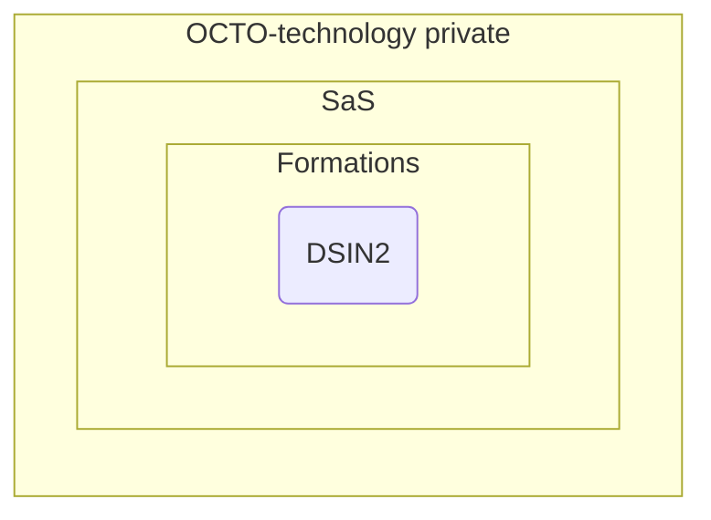
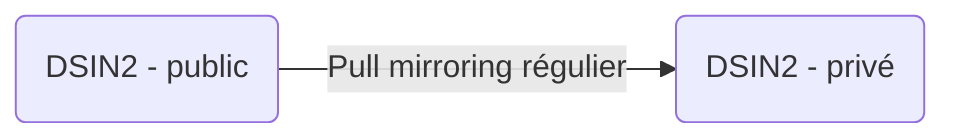

# Procédure de mirroring

Ce document décrit comment mettre en place un repo mirroir pour le code de la formation dsin2 soit disponible pour les clients de la formation.

## Why

Le repo dsin2 est dans le groupe privé OCTO. Les groupes sous-jacents héritent du caractère privé de la visibilité du groupe OCTO, et cette visibilité ne peut être changée.



**Problème ➡️ Les clients de la formation doivent pouvoir cloner ce repo `dsin2`.**

Pour y remédier, on créé un repo public `dsin2` clonable par tous, et on y duplique le contenu du repo privé `dsin2`.



## Procédure pour créer le repo mirroir

1. Dans le repo dsin2 privé, générer un Access Token avec la permission `read_repository`
1. Créer un repo vide nommé `dsin2` à visibilité public
2. Dans le menu latéral de ce nouveau repo, aller dans `Settings > Repository`,
3. Dérouler le menu `Mirroring repositories`
4. Configurer le mirroring comme suit :
   1. Git repository URL : `https://mhouacine@gitlab.com/octo-technology/les-bg-de-la-data/s-s-all/formation/dsin2.git` en remplaçant `mhouacine` par votre login gitlab.
   2. Mirror direction : `Pull` ⬇️
   3. Authentication method : `Password` 🙊
   4. Password : <insérer ici l'Access Token créer plus tôt>.
   5. Attendre un peu (3-4 minutes), le premier pull peut être long.

### Tests de recette

- Vous n'obtenez pas de message `pull mirroring failed XX minutes ago` sur la page d'accueil du repo
- Les fichiers du repo dsin2 privé sont bien disponibles dans ce repo public après clonage
- Toutes les branches du repo dsin2 privé sont bien disponibles dans ce repo public après clonage

Si le mirroring échoue, vous pouvez tester que votre `Access Token` fonctionne bien en essayant de cloner le repo dsin2 privé en local en mode HTTPS avec authent' par mot de passe :

```
$> git clone https://mhouacine@gitlab.com/octo-technology/les-bg-de-la-data/s-s-all/formation/dsin2.git

// en cas de succès :
Clonage dans 'dsin2'...
remote: Enumerating objects: 1379, done.
remote: Counting objects: 100% (354/354), done.

// en cas d'erreur :
Clonage dans 'dsin2'...
remote: HTTP Basic: Access denied
fatal: Échec d'authentification pour 'https://...`
```