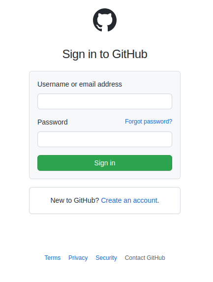
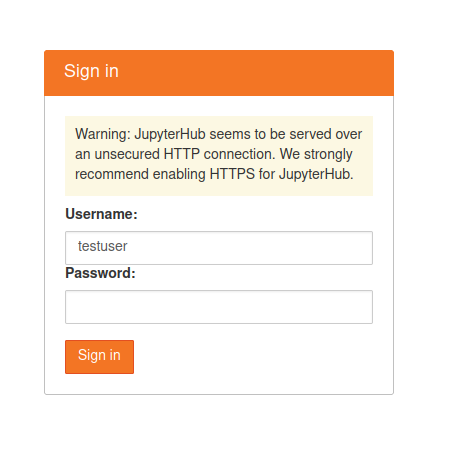
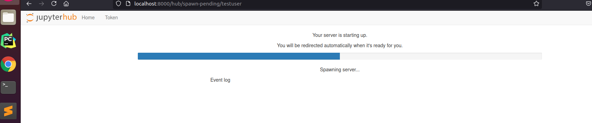
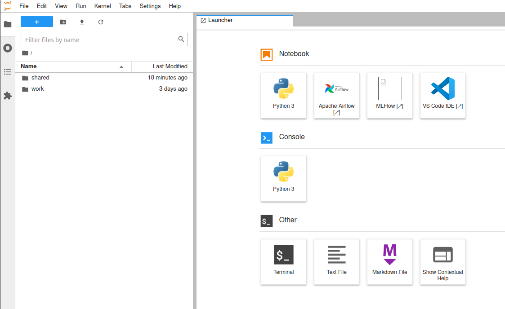
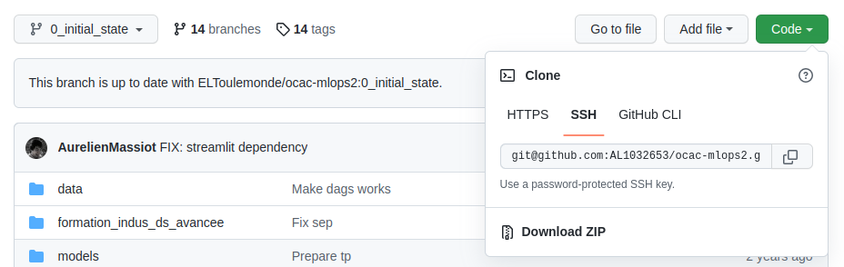
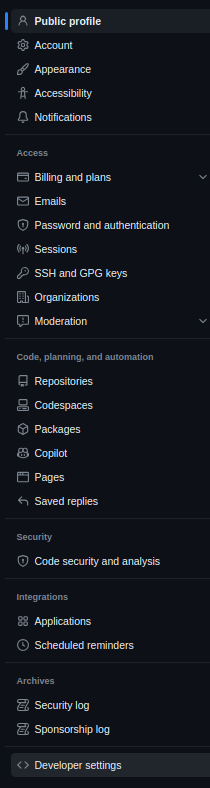
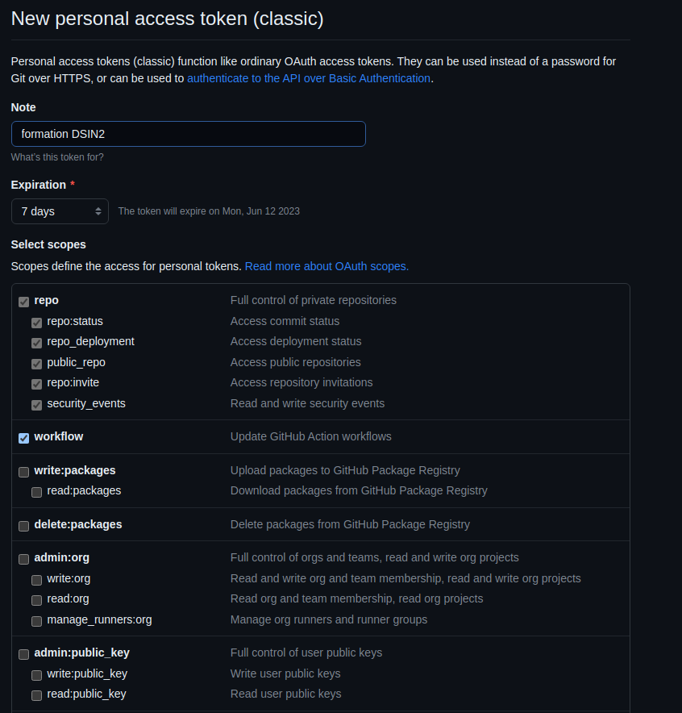

summary: TP0 - Setup de l'environnement de travail
id: tp0
categories: setup
tags: setup
status: Published
authors: OCTO Technology
Feedback Link: https://github.com/octo-technology/Formation-MLOps-2/issues/new/choose

# TP0 - Préparation de l'environnement de travail

## Vue d'ensemble

Durée : 15 min

Cette partie permet de préparer l'environnement de travail pour les TPs.

## Créer un compte sur Github

Durée : 2 min

### Création du compte

Rendez-vous sur le site de Github afin de créer un compte si vous n'en possédez pas déjà
un : <https://github.com/login>.

Puis, cliquez sur `Create account`:



### Fork du repository de TP dans votre espace personnel Github

Une fois votre compte créé, rendez-vous sur la page du repository de code de cette
formation : <https://github.com/octo-technology/Formation-MLOps-2>

Puis `forkez` le repo à l'aide du bouton `Fork` en haut à droite pour récupérer une copie de ce dernier dans votre
espace Github personnel :


🏁 Vous possédez désormais une copie personnelle du repository de code pour les TPs ! Nous allons désormais la cloner
dans votre environnement de développement.

## Prise en main de Jupyterhub, l'environnement de TP

Durée : 3 min

Pour vous connecter sur l'interface de TP, l'instructeur vous aura donné votre identifiant/mot de passe :


Une fois connecté, une page de chargement apparaît, temps pendant lequel votre environnement de TP est créé :


Cela peut prendre 1 à 2 minutes, mais pas plus. Si votre environment ne démarre pas vous pouvez essayer d'actualiser
puis faire appel à votre formateur.

Une fois que le serveur est démarré vous êtes redirigé vers la page principale :


Depuis cette page vous pouvez ouvrir :

- Un terminal : dans other / terminal
- Un éditeur de code en ligne : dans Notebook / VS Code
- Airflow et MLFlow que nous manipulerons

Vous pouvez également changer votre mot de passe [ici](https://lab.aws.octo.training/jupyter/hub/auth/change-password).

## Préparer son environnement et cloner le repo

Durée : 3min

Rendez-vous sur votre environnement de développement.

L'URL de ce dernier vous sera communiqué pendant la formation.

Dans VSCode, ouvrez un terminal afin d'y cloner le repository de code des TPs avec la commande `$> git clone <url>;`.
Vous trouverez l'URL de clonage en HTTPS sur github, dans le repo que vous avez forké :

Pour ouvrir un terminal il faut cliquer sur les 2 barres parallèles en haut à droite puis `terminal`
puis `new terminal`.


En tapant la commande `git branch` vous pourrez constater que vous êtes sur la branche `0_initial_state`

Ensuite, nous allons créer un environnement de travail Python avec Conda et installer les dépendances :

```bash
conda create -yqf python=3.9 --name python_indus_avancee
source activate python_indus_avancee
pip install -e .
pip install -r requirements_test.txt
```

Exécutons les tests pour s'assurer que tout fonctionne !

```bash
make tests-unitaires
```

## Créer un token d'authentification

Durée : 5min

Depuis peu, github ne supporte plus l'authentification en username-password, notamment pour pousser son code. 

Il est possible d'utiliser une clé ssh et un token d'authentification, c'est ce que nous allons faire.

Allez sur github.com, puis en étant connecté(e), allez dans les paramètres 


Puis, scrollez et allez dans la section "Developer settings"


Puis dans "personal acess tokens/Tokens (classic)", générez un nouveau token avec les droits sur les repo et sur les workflows


Copiez-collez votre token, vous n'y aurez plus accès ensuite, vous l'utiliserez pour pousser votre code 

## Lien vers le TP suivant

Les instructions du tp suivant sont [ici](https://octo-technology.github.io/Formation-MLOps-2/tp1#0)