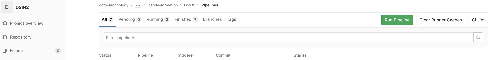

summary: TP1 - Introduction à la CI/CD
id: tp1
categories: CI
tags: CI,CD,gitlab
status: Published
authors: OCTO Technology
Feedback Link: https://gitlab.com/octo-technology/octo-bda/cercle-formation/dsin2/-/issues/new

# TP1 - Introduction à la CI/CD

## Overview
Duration: 30

### A l'issue de cette section, vous aurez découvert:

- 📄Comment lire un fichier de pipeline `.gitlab-ci.yml`,
- 🚀Comment exécuter un pipeline gitlab, manuellement ou via commit & push
- 🖊Comment éditer un pipeline gitlab,
- ✅Comment tester le fonctionnement d'une application Python dans une chaîne d'intégration continue,
- ✔ Comment mesurer la qualité d'une application Python dans une chaîne de CI,
- 📦Comment packager une application Python dans une chaîne de CI, au format `wheel` et `docker`,
- 🐳Comment manipuler les registres gitlab pour Python et Docker.

### Présentation des nouveautés sur la branche de ce TP

Pour ce TP, utiliser la branch 1_starting_ci

`git checkout 1_starting_ci`

Sur cette branche, il y a maintenant : 
- Un fichier `.gitlab-ci.yml` qui contient le squelette d'une CI. 

## Exécuter le pipeline de CI
Duration: 1

Un pipeline de CI est déjà présent dans ce repo, nous allons l'exécuter.

Dans le panneau de gauche, rendez-vous dans: `CI/CD` > `Pipelines`.

Puis cliquez sur `Run pipeline`:  et valider le formulaire de déclenchement sur la branche `1_starting_ci`.

❌Malheureusement, le pipeline a échoué ...


Il va falloir le faire passer au vert !

## Un mot sur les pipelines Gitlab

`Gitlab CI/CD` est un outil mis à disposition de Gitlab pour construire des pipelines de traitements.

Ces pipelines peuvent être utilisés à des fins d'intégration continue.

Le pipeline est décrit au travers de code, dans un fichier [.gitlab-ci.yml](../../.gitlab-ci.yml), à la racine du repo en langage [`YAML`](https://learnxinyminutes.com/docs/fr-fr/yaml-fr/), une spec de configuration similaire au `JSON`.

La documentation de gitlab ainsi que les mot-clefs utilisables dans le `.gitlab-ci.yml` sont consultables sur <https://docs.gitlab.com/ee/ci/yaml/README.html>.

### Exemple décrit en Python

Un exemple officiel en Python est disponible sur le repository Gitlab de Gitlab: <https://gitlab.com/gitlab-org/gitlab/-/blob/master/lib/gitlab/ci/templates/Python.gitlab-ci.yml>, nous allons le décrire briévement ci-après:

```yaml
## Un exemple de fichier .gitlab-ci.yml

# Le pipeline va s'exécuter dans une image docker.
# En l'ocurrence, il s'agit de l'image python officielle
# la plus à jour dans le dockerhub: https://hub.docker.com/r/library/python/tags/
image: python:latest

# Il est possible de définir des variables d'environnement
# qui seront disponibles dans la suite du pipeline.
variables:
  PIP_CACHE_DIR: "$CI_PROJECT_DIR/.cache/pip"

# Une étape nommée "test" est ajoutée au pipeline
test:
  script:
    - python setup.py test
    - pip install tox flake8  # you can also use tox
    - tox -e py36,flake8

# Une étape nommé "run" est ajoutée au pipeline.
# Elle s'exécutera si l'étape "test" se termine avec succès.
run:
  script:
    - python setup.py bdist_wheel
  # La direction "artifacts" permet de sauvegarder
  # des objets construits lors de l'exécution du pipeline.
  artifacts:
    paths:
      - dist/*.whl

# Une étape nommé "pages" est ajoutée au pipeline.
# Elle s'exécutera si l'étape "run" se termine avec succès.
pages:
  script:
    - pip install sphinx sphinx-rtd-theme
    - cd doc ; make html
    - mv build/html/ ../public/
  artifacts:
    paths:
      - public
  # Cette étape "pages" ne s'exécutera que si l'étape précédente ("run") est réussie
  # ET si la branche d'exécution du pipeline est master.
  only:
    - master
```

## Exercice: Compléter le pipeline de CI pour le faire passer au vert
Duration: 1

Votre mission si vous l'acceptez: éditez le fichier `.gitlab-ci.yml` à la racine du repository pour exécuter les tests avec succès et faire passer le pipeline au vert ✅.

Une fois que vous aurez apporté vos modifications, vous devrez commiter cela sur gitlab.

Comme il s'agit de notre premier commit il va falloir définir notre nom et notre adresse email :

```bash
git config --global user.email "you@example.com"
git config --global user.name "Your Name"
```

Vous pourrez ensuite `commit` et `push`

Pour `push` git demandera votre id et mot de passe ge gitlab. Une alternative est de mettre en place une clef ssh ou un 
personnal access token.
