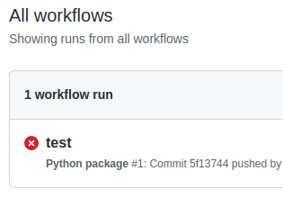

summary: TP1 - Introduction à la CI/CD
id: tp1
categories: CI
tags: CI,CD
status: Published
authors: OCTO Technology
Feedback Link: https://github.com/octo-technology/Formation-MLOps-2/issues/new/choose

# TP1 - Introduction à la CI/CD

## Vue d'ensemble
Durée : 30 min

### À l'issue de cette section, vous aurez découvert :

- 📄Comment lire un fichier de pipeline `ci.yml`,
- 🚀Comment exécuter un pipeline github Actions, manuellement ou via commit & push
- 🖊Comment éditer un pipeline github,
- ✅Comment tester le fonctionnement d'une application Python dans une chaîne d'intégration continue,
- ✔ Comment mesurer la qualité d'une application Python dans une chaîne de CI,
- 📦Comment packager une application Python dans une chaîne de CI, aux formats `wheel` et `docker`,
- 🐳Comment manipuler les registres github pour Python et Docker.

### Présentation des nouveautés sur la branche de ce TP

Pour ce TP, utilisez la branch 1_starting_ci

`git checkout 1_starting_ci`

Sur cette branche, il y a maintenant : 
- Un fichier `.github/workflows/ci.yml` qui contient le squelette d'une CI. 

## Exécuter le pipeline de CI
Duration: 1

Un pipeline de CI est déjà présent dans ce repo, nous allons l'exécuter.

Comme vous avez forké un repo existant, github actions a besoin d'une notification de création de fichier dans `.github/workflows` 
pour qu'il détecte qu'il y a une CI à exécuter.

Pour cela renommez le fichier `ci.yml` en `ci-workflow.yml`. (Le fichier peut avoir n'importe quel nom, tant qu'il est dans le bon repository cela marchera).

Commitez et pushez ce changement
```shell
git add .github/workflows/ci.yml
git commit -m "Rename workflow file"
git push
```

Comme il s'agit de notre premier commit il va falloir définir notre nom et notre adresse email :

```bash
git config --global user.email "you@example.com"
git config --global user.name "Your Name"
```

Pour `push`, Git demandera vos identifiants et mot de passe de Github. Une alternative est de mettre en place une clef SSH ou un 
personal access token.

Puis allez dans l'onglet github actions


❌Malheureusement, le pipeline a échoué ...



Il va falloir le faire passer au vert !

## Un mot sur les pipelines Github

`Github actions` est un outil mis à disposition de Github pour construire des pipelines de traitements.

Ces pipelines peuvent être utilisés à des fins d'intégration continue.

Le pipeline est décrit au travers de code, dans un fichier dans le dossier `.github/workflows` en langage [`YAML`](https://learnxinyminutes.com/docs/fr-fr/yaml-fr/), une spec de configuration similaire au `JSON`.

La documentation des github Actions ainsi que les mot-clefs utilisables dans les workflows sont consultables sur <https://docs.github.com/en/actions/automating-builds-and-tests/building-and-testing-python>.

### Exemple décrit en Python

Un exemple officiel en Python est disponible sur le repository Github: <https://docs.github.com/en/actions/automating-builds-and-tests/building-and-testing-python>, nous allons le décrire briévement ci-après:

```yaml
# Nom du workflow tel que visible dans l'interface
name: Python package

# Evènements qui vont lancer la CI
on: [push]

jobs:
  build:
    # Configuration de la machine utilisée pour lancer la CI
    runs-on: ubuntu-latest
    strategy:
      matrix:
        python-version: ["3.7", "3.8", "3.9", "3.10"]

    steps:
      # Pull du code
      - uses: actions/checkout@v3
      # Mise en place de python
      - name: Set up Python ${{ matrix.python-version }}
        uses: actions/setup-python@v4
        with:
          python-version: ${{ matrix.python-version }}
      - name: Install dependencies
        run: |
          python -m pip install --upgrade pip
          pip install flake8 pytest
          if [ -f requirements.txt ]; then pip install -r requirements.txt; fi
      - name: Lint with flake8
        run: |
          # stop the build if there are Python syntax errors or undefined names
          flake8 . --count --select=E9,F63,F7,F82 --show-source --statistics
          # exit-zero treats all errors as warnings. The GitHub editor is 127 chars wide
          flake8 . --count --exit-zero --max-complexity=10 --max-line-length=127 --statistics
      - name: Test with pytest
        run: |
          pytest
```

## Exercice: Compléter le pipeline de CI pour le faire passer au vert
Durée : 1 min

Votre mission si vous l'acceptez : éditez le fichier `.github/workflow/ci-workflow.yml` à la racine du repository pour exécuter les tests avec succès et faire passer le pipeline au vert ✅.

Une fois que vous aurez apporté vos modifications, vous devrez commiter cela sur github.

Vous pourrez ensuite `commit` et `push`

## Pour aller plus loin

Ajouter à votre CI :
- Une détection d'inadéquations au standard pep8 avec la librairie `flake8` ([disponible sur pypi](https://pypi.org/project/flake8/))
- Une détection de code mort avec la librairie `vulture` ([disponible sur sur pypi](https://pypi.org/project/vulture/))

Vous pouvez creuser la façon d'ajouter des étapes sur votre pipeline avec [cette](https://docs.github.com/fr/actions/quickstart) documentation.

Finalement vous pouvez explorer comment ajouter des vérifications de sécurité dans votre CI avec le template SAST en lisant [cette](https://github.com/marketplace/actions/sast-scan) documentation.

## Lien vers le TP suivant

Les instructions du tp suivant sont [ici](https://octo-technology.github.io/Formation-MLOps-2/tp2#0)