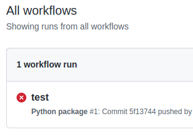

summary: TP1 - Introduction à la CI/CD
id: tp1
categories: CI
tags: CI,CD
status: Published
authors: OCTO Technology
Feedback Link: https://github.com/octo-technology/Formation-MLOps-2/issues/new/choose

# TP1 - Introduction à la CI/CD

## Vue d'ensemble

Duration: 0:05:00

### À l'issue de cette section, vous aurez découvert :

- 📄Comment lire un fichier de pipeline `ci.yml`,
- 🚀Comment exécuter un pipeline github Actions, manuellement ou via commit & push
- 🖊Comment éditer un pipeline github,
- ✅Comment tester le fonctionnement d'une application Python dans une chaîne d'intégration continue,
- ✔ Comment mesurer la qualité d'une application Python dans une chaîne de CI,
- 📦Comment packager une application Python dans une chaîne de CI, aux formats `wheel` et `docker`,
- 🐳Comment manipuler les registres github pour Python et Docker.

### Présentation des nouveautés sur la branche de ce TP

Pour ce TP, utilisez la branch 1_starting_ci

`git checkout 1_starting_ci`

Sur cette branche, il y a maintenant : 
- Un fichier `.github/workflows/ci.yml` qui contient le squelette d'une CI. 

## Exécuter le pipeline de CI

Duration: 0:05:00

Un pipeline de CI est déjà présent dans ce repo, nous allons l'exécuter.

Comme vous avez forké un repo existant, github actions a besoin d'une notification de création de fichier dans `.github/workflows` 
pour qu'il détecte qu'il y a une CI à exécuter.

Pour cela renommez le fichier `ci.yml` en `ci-workflow.yml`. (Le fichier peut avoir n'importe quel nom, tant qu'il est dans le bon repository cela marchera).
```shell
mv .github/workflows/ci.yml .github/workflows/ci-workflow.yml
```

Commitez et pushez ce changement
```shell
git add .github/workflows/ci-workflow.yml
git commit -m "Rename workflow file"
git push
```

Comme il s'agit de notre premier commit il va falloir définir notre nom et notre adresse email :

```bash
git config --global user.email "you@example.com"
git config --global user.name "Your Name"
```

Pour `push`, Git demandera vos identifiants et un mot de passe. Le mot de passe est le token que vous avez généré au TP0.

Une alternative est de mettre en place une clef SSH.

Puis allez dans l'onglet github actions


❌Malheureusement, le pipeline a échoué ...



Il va falloir le faire passer au vert !

## Un mot sur les pipelines Github

Duration: 0:05:00

`Github actions` est un outil mis à disposition de Github pour construire des pipelines de traitements.

Ces pipelines peuvent être utilisés à des fins d'intégration continue.

Le pipeline est décrit au travers de code, dans un fichier dans le dossier `.github/workflows` en langage [`YAML`](https://learnxinyminutes.com/docs/fr-fr/yaml-fr/), une spec de configuration similaire au `JSON`.

La documentation des github Actions ainsi que les mot-clefs utilisables dans les workflows sont consultables sur <https://docs.github.com/en/actions/automating-builds-and-tests/building-and-testing-python>.

### Exemple décrit en Python

Duration: 0:05:00

Un exemple officiel en Python est disponible sur le repository Github: <https://docs.github.com/en/actions/automating-builds-and-tests/building-and-testing-python>, nous allons le décrire briévement ci-après:

```yaml
# Nom du workflow tel que visible dans l'interface
name: Python package

# Evènements qui vont lancer la CI
on: [push]

jobs:
  build:
    # Configuration de la machine utilisée pour lancer la CI
    runs-on: ubuntu-latest
    strategy:
      matrix:
        python-version: ["3.7", "3.8", "3.9", "3.10"]

    steps:
        # Pull du code
        - uses: actions/checkout@v6
        - name: Set up Python
          uses: actions/setup-python@v5
          with:
            python-version: '3.x'
        - name: Install the code linting and formatting tool Ruff
          run: pipx install ruff
        - name: Lint code with Ruff
          run: ruff check --output-format=github --target-version=py39
        - name: Check code formatting with Ruff
          run: ruff format --diff --target-version=py39
          continue-on-error: true
        - name: Test with pytest
          run: pytest
```

## Exercice: Compléter le pipeline de CI pour le faire passer au vert

Duration: 0:10:00

Votre mission si vous l'acceptez : éditez le fichier `.github/workflow/ci-workflow.yml` à la racine du repository pour exécuter les tests avec succès et faire passer le pipeline au vert ✅.

Une fois que vous aurez apporté vos modifications, vous devrez commiter cela sur github.

Vous pourrez ensuite `commit` et `push`

## Pour aller plus loin

Duration: 0:15:00

Ajouter à votre CI :
- Une détection d'inadéquations au standard pep8 avec la librairie `ruff` ([disponible sur pypi](https://pypi.org/project/ruff/))
- Une détection de code mort avec la librairie `vulture` ([disponible sur sur pypi](https://pypi.org/project/vulture/))

Vous pouvez creuser la façon d'ajouter des étapes sur votre pipeline avec [cette](https://docs.github.com/fr/actions/quickstart) documentation.

Finalement, vous pouvez explorer comment ajouter des vérifications de sécurité dans votre CI avec le template SAST en lisant [cette](https://github.com/marketplace/actions/sast-scan) documentation.

## Lien vers le TP suivant

Duration: 0:01:00

Les instructions du tp suivant sont [ici](https://octo-technology.github.io/Formation-MLOps-2/tp2#0)