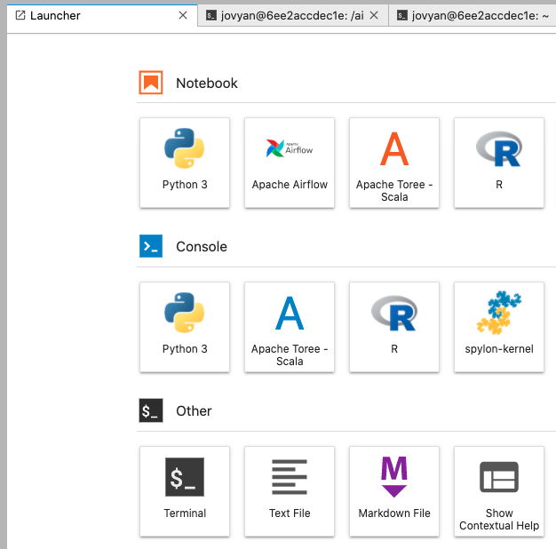
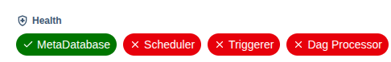
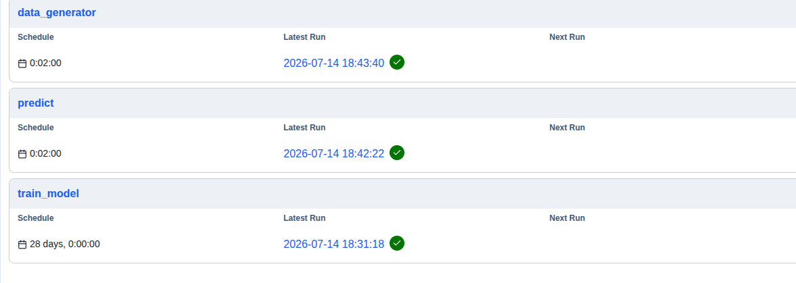
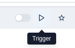
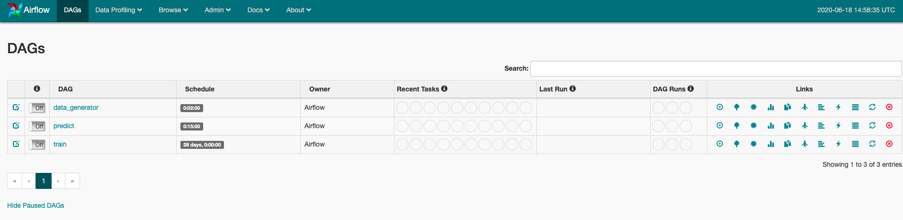
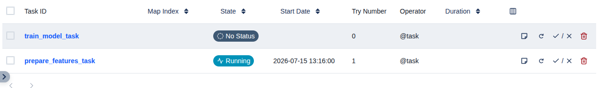

summary: TP4
id: tp4
categories: tp, api
tags: api, flask
status: Published
authors: OCTO Technology
Feedback Link: https://github.com/octo-technology/Formation-MLOps-2/issues/new/choose

# TP4 - Orchestration

## Vue d'ensemble

Duration: 0:05:00

### À l'issue de cette section, vous aurez découvert

- Découvrir l'orchestration avec Airflow,
- Découvrir et comprendre les différents composants d'airflow
- Savoir créer un `DAG` et les scheduler,
- Savoir créer des `tasks` Airflow et les orchestrer,
- Comprendre la gestion des `IO` avec Airflow.
- Découvrir une implémentation légère d'un système événementiel.

### Présentation des nouveautés sur la branche de ce TP

Pour ce TP, utilisez la branch suivante :

`git checkout 4_starting_orchestration`

Sur cette branche, il y a maintenant :

- Un DAG `dags/train.py` qui permet d'entraîner un modèle
- Un DAG `dags/predict.py` qui est incomplet et qui permettra de réaliser des prédictions
- Les fonctions existantes dans `formation_mlops_2/` ont été décorées avec des `read` et des `write` pour donner des fonctions `function_name_with_io`

## Scripts à disposition

Duration: 0:05:00

Le dossier `scripts` contient des scripts d'entraînement et de prédiction pour notre cas d'usage de Machine Learning.

Nous allons désormais voir comment orchestrer ces tâches grâce à `Airflow`.

## Revue de code avec les formateurs

Duration: 0:10:00

Revue de code avec les formateurs pour introduire les concepts de DAGs et de tâches dans le code.

### Gestion des IO

Duration: 0:10:00

Il n'est pas conseillé de partager en mémoire de la donnée d'une tâche à l'autre dans un DAG Airflow, il convient plutôt de les écrires dans des fichiers.

Pour répondre à ce problème, nous avons décoré la fonction de prédiction avec

- une fonction permettant de lire un fichier en entrée,
- et d'écrire le résultat de la tâche dans un fichier en sortie.

A l'image des fonctions `train_with_io` et `train` du module `train_and_predict.py` dans `/formation_mlops_2`, nous avons créé une fonction `predict_with_io` qui soit utilisable par le DAG Airflow.

Les prédictions réalisées sont écrites dans 2 fichiers identiques :

- {date}.csv où la date est au format `%Y%m%d-%H%M%S`
- latest.csv

Les méthodes `_with_io` ont également des `import` lazy, c'est-à-dire qu'ils se font au runtime, plutôt qu'au chargement du script pour accélérer le `dag-orchestrator`.

## Démarrer avec Airflow

Duration: 0:10:00

### Configuration de Airflow
Airflow se configure à travers un fichier de configuration situé dans le dossier `airflow_home`. Il est possible de configurer Airflow à travers des variables d'environnement, mais pour ce TP, nous allons utiliser le fichier de configuration.

Pour voir l'ensemble des configurations possibles, allez voir [la documentation officielle](https://airflow.apache.org/docs/apache-airflow/stable/configurations-ref.html).

Nous devons apporter quelques modifications au fichier de configuration actuel : 
- Pour cela, ouvrez `/airflow/airflow.cfg`, avec l'éditeur nano : `nano /airflow/airflow.cfg`, ou bien avec vscode.
    - Changer la variable `dags_folder` pour pointer sur `/home/jovyan/Formation-MLOps-2/dags`, cela permet d'indiquer à
      airflow où se situent vos DAGs
    - Mettre lod_examples à False afin de ne pas charger les DAGs d'exemples

```toml
# Fichier /airflow/airflow.cfg
[core]
# The folder where your airflow pipelines live, most likely a
# subfolder in a code repository
# This path must be absolute
dags_folder = /airflow/dags

...

# Whether to load the examples that ship with Airflow.
load_examples = False

...

```

### Démarrer les différents services Airflow
Commençons par démarrer l'interface graphique d'Airflow, nous l'avons intégré dans l'environnement de TP.

Dans le `Launcher`, lancer le service `Airflow`. 


L'interface graphique d'Airflow devrait s'ouvrir dans un nouvel onglet. Si le lancement indique `could not start airflow in time` cela peut vouloir dire qu'Airflow n'a pas encore démarré, essayer de refresh quelques secondes plus tard, sinon sollicitez votre formateur.

Les identifiants de connection à airflow sont `admin:admin`

L'interface vous indique que les différents services ne sont pas accessibles pour l'instant, c'est normal. 


Naviguez, dans l'onglet Dags. Vous ne voyez pour l'instant pas de DAG, il faut alors lancer le dag processor, il se charge de parcourir votre dossier de dags, et de les parser.
```shell
uv run airflow dag-processor
```
Il ne faudrat pas fermer ce terminal, au risque d'arrêter le service.

La mise à jour des dags sera faite par ce service, qui les refresh par défaut toutes les 30 secondes. Pour forcer un refresh, vous pourrez l'arrêter et le relancer.

Nous allons maintenant lancer le scheduler, dans un nouveau terminal :
```shell
uv run airflow scheduler
```

Finalement, il faut lancer l'exécution : `uv run airflow api-server --apps execution` pour qu'un service s'occupe de réaliser les tâches.

L'interface graphique devrait désormais afficher 3 DAGs :



## Lancer un premier DAG d'entraînement

Duration: 0:05:00

Afin de s'entraîner, il va nous falloir des données d'entraînement !

Elles ne sont pas versionnées dans ce repo. Télécharger les données avec la commande `make dataset`.

Les données sont désormais disponibles dans `data/la-haute-borne-data-2017-2020.csv`.

Pour lancer le DAG `train`:

- Activer le DAG en appuyant sur le bouton `Play` (à droite de chaque ligne de DAG),



Inspecter le DAG `train` en cliquant sur celui-ci, la tâche `prepare_features` devrait avoir commencé :



Vous pouvez explorer les différentes informations, visuels qu'offre cette vue de DAGs.

## DAG de prédiction

Duration: 0:15:00

Compléter le DAG `dags/predict` pour intégrer la fonction `predict_with_io` dans un opérateur, avec les bons arguments.

Lancer le dag `data_denerator` pour qu'il produise toutes les 2 minutes un petit jeu de données sur lequel nous pourrons faire des inférences.

Puis lancer le dag `predict` pour qu'il face les prédictions. 

## Découvrir une implémentation légère d'un système événementiel

Duration: 0:05:00

Après avoir manipulé des DAGs opérées par de la logique d'orchestration et le temps, nous vous proposons de découvrir le fonctionnement d'un système événementiel..

Pour illustrer ce à quoi ressemble une architecture événementiel, nous allons ouvrir deux terminaux.
1. L'émetteur : Il envoi des messages
   - Ouvrir un terminal
   - Créer la queue d'évènement : `touch /tmp/event.txt`
   - Envoyez un message : `echo "Hello World" >> /tmp/event.txt`
2. Le listener : il écoute les évènements et les traites. 
  - Ouvrir un terminal
  - Lancer la commande : `tail -f -n 1 /tmp/event.txt | xargs -I {} sh -c 'echo "{}" | wc -c'`
  - Elle capture la dernière ligne du fichier event.txt, et exécute une fonction métier, ici le nombre de lettres dans l'évènement.
3. Essayer d'envoyer des nouveaux messages en observant le comportement du listener

Cette implémentation basique est une illustration du comportement d'un système événementiel, si il y a un nouveau message il agit, sinon il ne fait rien. A la différnece d'un CRON qui tentera toujours de faire quelque chose, dont parfois constater la différence avec la précédente exé&cution.

Les systèmes événementiels tels que Kafka, RabbitMQ... offre bien entendu plus de fonctionnalité, de robustesse, de scalabilité.

## Pour aller plus loin

- Réfléchir au découpage des DAGs que vous pourriez avoir dans votre application.
- Réfléchir aux avantages / inconvénients des approches événementielles ou CRON.

## Lien vers le TP suivant

Duration: 0:01:00

Les instructions du tp suivant sont [ici](https://octo-technology.github.io/Formation-MLOps-2/tp5#0)