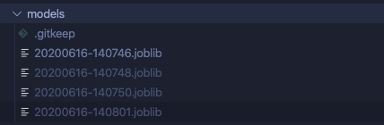
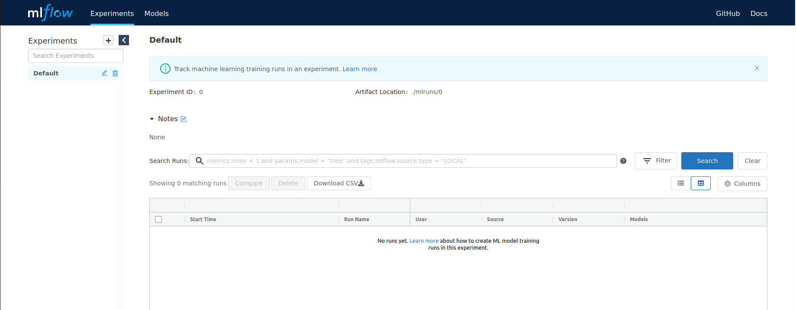
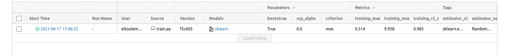
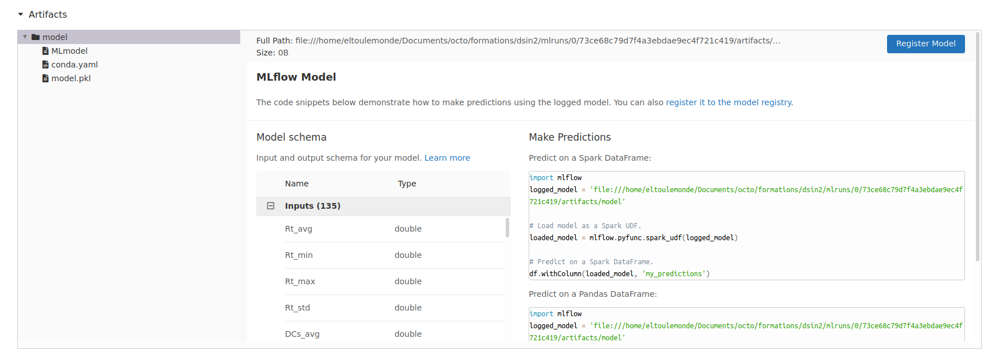

summary: TP5
id: tp5
categories: tp, artifacts
tags: artifacts
status: Published
authors: OCTO Technology
Feedback Link: https://github.com/octo-technology/Formation-MLOps-2/issues/new/choose

# TP5 - Artefacts

## Vue d'ensemble

Duration: 0:05:00

### À l'issue de cette section, vous aurez découvert

- Une stratégie simple de versioning de modèles : les timestamps et leur limitations
- Une stratégie avancée de versioning de modèles : utiliser MLflow
  - L'interface MLflow tracking & registry,
  - Comment stocker vos expérimentations dans MLflow,
  - Le système de dossier de MLflow,
  - Le versioning de modèle avec MLflow.


### Présentation des nouveautés sur la branche de ce TP

Pour ce TP, utilisez la branch 5_starting_artifacts

`git checkout 5_starting_artifacts`

## Versionner les modèles avec un timestamp

Duration: 0:05:00

Pour l'instant, les modèles sont sauvegardés par la fonction `train_model`.

Ils possèdent le même nom de fichier, ce qui signifie que chaque entraînement produit un modèle, mais que le modèle ainsi produit écrase le précédent 😕.

Ceci est problématique pour des raisons

- de suivi et d'auditabilité : un modèle est déployé, mais je ne sais pas lequel précisément.
- de reproductibilité : comme je ne sais pas quel modèle est déployé, je ne peux pas facilement effectuer un roll-back vers un précédent modèle plus stable si le modèle que je viens de déployer est défectueux.

Un moyen de distinguer un modèle d'un autre à chaque entraînement est *d'intégrer un identifiant unique à son nom*.

Un moyen simple d'y parvenir est d'utiliser un horodatage.

**L'objectif de ce TP est de modifier le nom du modèle généré en intégrant un timestamp au format YYYYMMDD-HHMMSS (`'%Y%m%d-%H%M%S'`).**

Exécuter plusieurs entraînements devrait produire plusieurs modèles identifiables comme ceci dans votre *model registry* :



- A quoi ce timestamp sert-il ?
- Quelles limitations voyez-vous à cette technique ?

## Accéder à MLflow

Duration: 0:02:00

`Depuis l'interface de Jupyterhub, vous pouvez cliquer sur l'icône MLflow pour lancer MLflow qui va s'ouvrir dans un nouvel onglet.

`

## Versionner les expérimentations avec MLflow

Duration: 0:15:00

Pour logger le résultat des expérimentations dans MLflow tracking il faut ajouter un peu de code sur le code d'entraînement.


```python
import mlflow
...
with mlflow.start_run() as run:
    mlflow.sklearn.autolog()
    model = ...
    model.fit(X, y)
```

Une fois que vous avez intégré ce code, vous pouvez retourner dans l'interface Airflow et déclencher un entraînement.

### Explorer le run créé dans MLflow

Duration: 0:05:00

Actualiser la page de MLflow pour voir les runs apparaître



Vous pouvez voir l'ensemble des paramètres et métriques stockées.

Ensuite en cliquant sur le run, vous pouvez aller voir plus de détails et en descendant voir l'artefact généré



### Explorer le système de dossier de MLflow

Duration: 0:10:00

En fait MLflow est basé sur un système de dossier / fichiers plats qui contiennent tout ce que l'on vient de voir.
En plus de cela, MLflow se sert d'une base de donnée locale pour stocker les métadonnées liés aux runs

Vous pouvez parcourir les métadonnées en explorant le fichier mlflow.db à la racine
```shell
sqlite3 mlflow.db
```

Listez les tables avec commande
```shell
.tables
```

ou faire une requête SQL qui liste toutes vos expérimentations
```shell
SELECT * FROM experiments;
```

ou encore, lister toutes vos métriques
```shell
SELECT * FROM metrics;
```

### Sauvegarder le modèle dans MLflow registry

Duration: 0:05:00

Modifier le code d'entrainement pour sauvegarder le modèle dans MLflow registry :  

```python
mlflow.sklearn.log_model(
   sk_model=model,
   name="A nice name for your model",
   input_example=X_train,
   registered_model_name="A nice name for your registered model",
)

```

Lancez l'entraînement plusieurs fois et regardez la version du modèle s'incrémenter dans la Model Registry

Parcourez le dossier `/home/jovyan/mlartifacts/0` pour voir vos artefacts organisés par run


## Lien vers le TP suivant

Duration: 0:01:00

Les instructions du tp suivant sont [ici](https://octo-technology.github.io/Formation-MLOps-2/tp6#0)