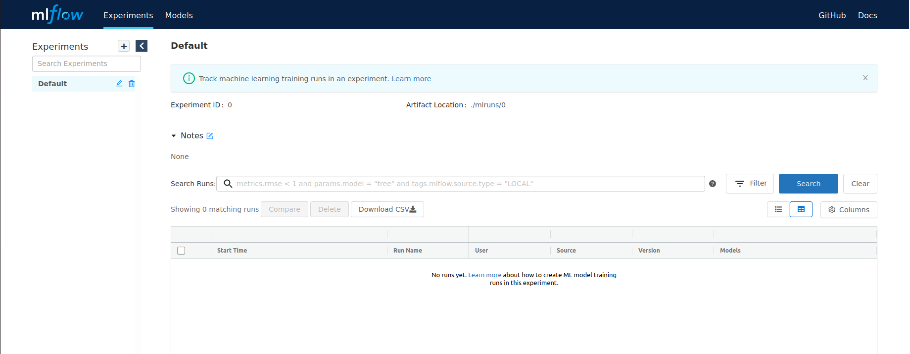
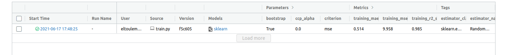
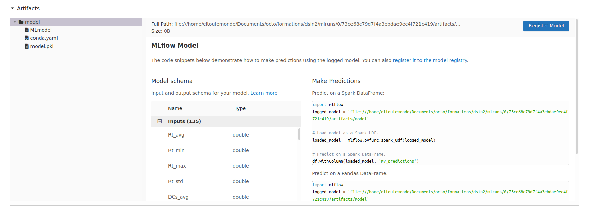

summary: TP6
id: tp6
categories: tp, api
tags: api, flask
status: Published
authors: OCTO Technology
Feedback Link: https://gitlab.com/octo-technology/les-bg-de-la-data/s-s-all/formation/dsin2/-/issues/new

# TP6 - Model registry

## Overview
Duration: 30


### A l'issue de cette section, vous aurez découvert

- L'interface MLFlow tracking,
- Comment stocker vos expérimentations dans mlflow,
- Le système de dossier de MLFlow,
- Le versionning de modèle avec MLFlow.

### Mise en place du TP

Pour ce TP, utiliser la branch 6_starting_mlflow

`git checkout 6_starting_mlflow`

Depuis l'interface de jupyterhub vous pouvez cliquer sur l'icon MLFLow pour lancer MLFlow qui va 
s'ouvrir dans un nouvel onglet.



## Intégrer MLFlow dans le code de training

Pour logger le résultat des expérimentations dans MLFlow tracking il faut ajouter un peu de code sur le code d'entraînement.


```python
import mlflow
...
with mlflow.start_run() as run:
    mlflow.sklearn.autolog()
    model = ...
    model.fit(X, y)
```

Une fois que vous avez intégré ce code, vous pouvez retourner dans l'interface airflow et trigger un entraînement.

## Explorer le run créé dans MLFlow
Actualiser la page de MLFlow pour voir les runs apparaître



Vous pouvez voir l'ensemble des paramètres et métriques stockées.

Ensuite en cliquant sur le run, vous pouvez aller voir plus de détail et en descendant voir l'artefact généré



## Explorer le système de dossier de MLFlow

En fait MLFlow est basé sur un système de dossier / fichiers plats qui contiennent tout ce que l'on vient de voir.

ALler dans cotre terminal et 
```shell
ls /home/jovyan/mlruns/
```

cela donne vos différentes expérimentations. Vous pouvez alors

```shell
ls /mlruns/0
```

cela contient vos différents runs au sein de cette expérimentation. Vous pouvez alors 
```shell
cat /mlruns/0/metadata.yml
```

ou 
```shell
ls /mlruns/0/<hashcode>
```


## Pour aller plus loin

- Ajouter le log d'une métrique ou d'un paramètre manuellement avec `mlflow.log_metric` `mlflow.log_param`
- Essayer de configurer une expérimentations
- Vous renseigner sur les URI et les différentes façons de mettre à disposition MLFlow (une db plutôt qu'un système de 
  fichier, MLFlow hébergé sur un serveur distant)/
