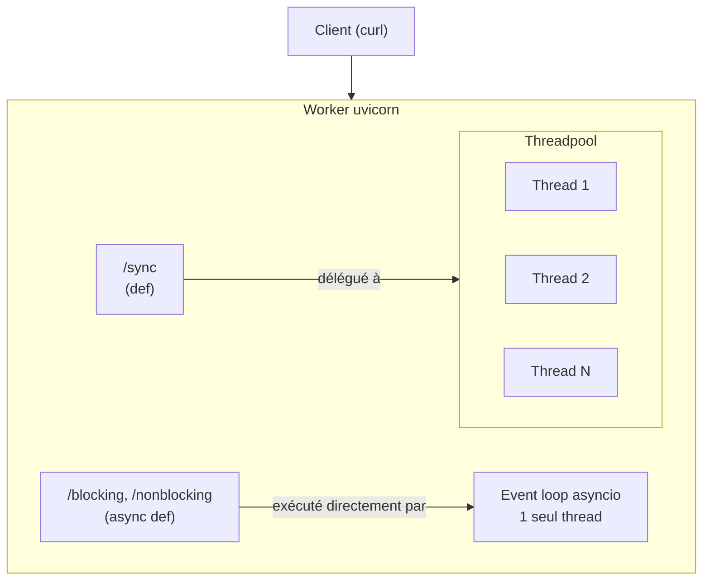

summary: TP6
id: tp6
categories: tp, api
tags: api, flask
status: Published
authors: OCTO Technology
Feedback Link: https://github.com/octo-technology/Formation-MLOps-2/issues/new/choose

# TP6 - Async / Sync

## Vue d'ensemble

Duration: 0:05:00


### À l'issue de cette section, vous aurez découvert

- Le fonctionnement de l'asynchronisme et du synchronisme dans une API

### Mise en place du TP

Pour ce TP, utilisez la branche suivante : 

```shell
git checkout 6_starting_async_sync
```

## Démonstration de l'utilisation de Async / Sync 

Duration: 0:15:00

### Explorer le code mis à disposition

Aller explorer le fichier [async_sync_api.py](../demos/async_sync_api.py), dedans 3 routes d'api sont définies : 
- blocking : Une API asynchrone qui exécute un `time.sleep`
- nonblocking : Une API asynchrone qui attend un process asynchrone 
- sync : Une API synchrone qui attend un process synchrone, 

Le paramètre `n` est là pour illustrer une complexité métier de l'appel, plus n est grand plus l'appel est long.

Le sleep est un moyen de modéliser facilement un long calcul.

### Lancer l'api
```shell
uv run  fastapi dev demos/async_sync_api.py 
```

Et tester avec un curl 
```shell
curl localhost:8000/blocking/1
```

### Comparer les délais de l'API blocking
Pour cela, nous allons utiliser deux terminaux : 1 pour chaque client : 

Lancer les commandes : 
```shell
curl localhost:8000/blocking/15
```

```shell
time curl localhost:8000/blocking/1
```

`time` permet de mesuré le temps mis. 

Combien de temps met le premier curl, et le deuxième ? 
Que se passe-t-il si on inverse l'ordre des curls ? 

### Comparer les temps de l'API non-blocking

Lancer les commandes : 
```shell
curl localhost:8000/nonblocking/15
```

```shell
time curl localhost:8000/nonblocking/1
```

`time` permet de mesuré le temps mis. 

Combien de temps met le premier curl, et le deuxième ? 
Que se passe-t-il si on inverse l'ordre des curls ? 

### Comparer les temps de l'API sync

Lancer les commandes : 
```shell
curl localhost:8000/sync/15
```

```shell
time curl localhost:8000/sync/1
```

`time` permet de mesuré le temps mis. 

Combien de temps met le premier curl, et le deuxième ? 

Il y a une parallélisation qui est faite au niveau des threads et non plus dans la boucle asyncio.

### Réduction du nombre de threads
Essayons de réduire le nombre de threads pour illustrer cette différence. 

Remplacer 
```python
app = FastAPI()
```

Par ce code qui passe de la valeur par défaut (40 threads) à 1 thread.
```python
@asynccontextmanager
async def lifespan(app: FastAPI):
    anyio.to_thread.current_default_thread_limiter().total_tokens = 1
    yield


app = FastAPI(lifespan=lifespan)
```

Relancer les temps sur les méthodes de sync et non-blocking.

### Schéma d'illustration

Le schéma ci-dessous montre, pour un worker uvicorn, qui exécute chaque type de route :


```mermaid
flowchart TB
    Client["Client (curl)"]

    subgraph W1["Worker uvicorn"]
        Route1["/blocking, /nonblocking<br/>(async def)"]
        Route2["/sync<br/>(def)"]

        Route1 -->|"exécuté directement par"| EL1["Event loop asyncio<br/>1 seul thread"]
        Route2 -->|"délégué à"| TP1

        subgraph TP1["Threadpool"]
            direction LR
            T1a["Thread 1"]
            T1b["Thread 2"]
            T1c["Thread N"]
        end
    end

    Client --> W1
```

Points clés à retenir :
- Le client appelle une route, qui détermine ensuite **où** elle va s'exécuter : `/blocking` et `/nonblocking` sont des coroutines (`async def`), donc l'event loop les exécute lui-même, sur son unique thread. `/sync` est une fonction classique (`def`), donc elle est déléguée à un thread du threadpool.
- Un seul **event loop** (un seul thread) par worker → si `/blocking` bloque ce thread avec `time.sleep`, tout le worker gèle.
- Le **threadpool** a plusieurs threads → les appels à `/sync` peuvent s'exécuter en parallèle, chacun dans son propre thread (limité par défaut à ~40 threads, ou 1 quand on le restreint plus bas dans ce TP).
- En augmentant le nombre de worker, on pourrait augmenter le nombre de threads du threadpool.

## Lien vers le TP suivant

Duration: 0:01:00

Les instructions du tp suivant sont [ici](https://octo-technology.github.io/Formation-MLOps-2/tp7#0)