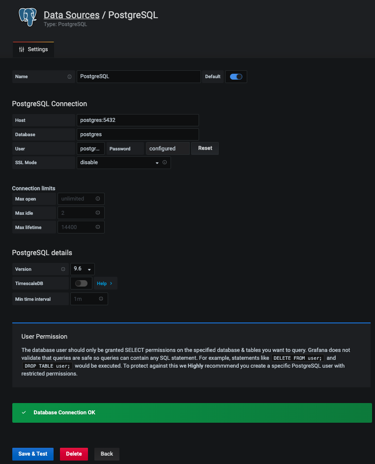

summary: TP8
id: tp8
categories: tp, api
tags: api, flask
status: Published
authors: OCTO Technology
Feedback Link: https://gitlab.com/octo-technology/octo-bda/cercle-formation/dsin2/-/issues/new

# TP8 - Monitoring de modèles

## Overview
Duration: 1

### A l'issue de cette section, vous aurez découvert

- 📈 Comment fonctionne Grafana, un outil de dashboarding,
- 🗄 Comment brancher une datasource PostgreSQL dans Grafana,
- 📈 Comment construire un dashboard de monitoring dans Grafana,
- ⚙️ Comment alimenter une base de données PostgreSQL avec des données de prédiction produites dans un pipeline Airflow

## Un mot sur PostgreSQL


PostgreSQL est un SGBD (Système de Gestion de Bases de Données) relationnel. C'est un système robuste que nous utilisons souvent en production dans nos missions à OCTO Technology.

Un `SGBD` PostgreSQL commun à tous les formés est déployé dans l'environnement de développement Jupyterhub, il est configuré comme suit:

- c'est un service dockerisé accessible sur le port `5432`,
- il est accessible avec le login: `postgres` et le mot de passe `postgres`,
- il contient 1 `base de donnees` nommée `postgres`,
- au démarrage, cette base de données ne contient aucune `table`. Mais cette création de table sera gérée par le DAG de prédiction Airflow.

Vérifiez cela en exécutant ligne par ligne ce qui suit dans un interpréteur Python:

```python
conn = psycopg2.connect("host=postgres dbname=postgres user=postgres password=postgres")

cur = conn.cursor()

# Afficher les tables dans la base de données
cur.execute("""SELECT table_name FROM information_schema.tables WHERE table_schema = 'public'""")
for table in cur.fetchall():
    print(table)

# Afficher le contenu de la table monitoring
cur.execute('SELECT * FROM monitoring;')
conn.commit()
print(cur.featchall())

conn.close()
```

Plus tard, ré-exécutez ces lignes après avoir exécuté au moins 1 fois le DAG de prédiction pour consulter les prédictions sauvegardées.

## Un mot sur Grafana


Grafana est un outil open-source permettant de construire des dashboards. Il est souvent utilisé par les ingénieurs opérationnels (ops) pour des tâches de monitoring de systèmes (RAM, CPU, consommation disque de serveurs, ...).

Une instance Grafana commune à tous les formés est déployée dans l'environnement de développement Jupyterhub, il est configuré comme suit:

- c'est un service dockerisé accessible sur le port `3000`,
- On peut s'y connecter avec le login `admin` et le mot de passe `admin`.

🏹 Vérifiez que le service grafana est disponible dans votre terminal avec `wget --server-response grafana:3000`.

Les formateurs vont désormais configurer grafana afin d'y connecter la base de données PostgreSQL en tant que `datasource`.

Dans Grafana,

- Ajoutez une datasource,
- Choisissez une datasource `PostgreSQL`,
- Configurez la data source:

| Variable           | Valeur          |
| ------------------ | --------------- |
| Name               | PostgreSQL      |
| Host               | <postgres:5432> |
| Database           | postgres        |
| User               | postgres        |
| Password           | postgres        |
| SSL Mode           | disable         |
| PostgreSQL version | 9.6             |



🏁 Vous pouvez désormais créer un dashboard branché sur cette source de données !

## Monitorer les prédictions d'un modèle

Dans le dag `dags/predict.py`:

- Ajoutez une tâche finale permettant de monitorer les prédictions. Cette tâche s'appuiera sur la fonction `monitor_with_io()` du module Python `formation_indus_avancee`.
- Modifiez la table de destination spécifiée dans la fonction `monitor_with_io()` avec un nom unique.
- Dans la console Airflow, activez le dag de prédiction.
- Une fois la tâche `monitor` du dag de prédiction terminée avec succès, rendez-vous dans Grafana pour construire votre dashboard !
  - Survolez le bouton ➕ dans la barre latérale pour créer un dashboard,
  - Pensez à le renommer pour ne pas le confondre avec celui de quelqu'un d'autre !
  - Ajoutez un panel et faites le pointer vers la data source "PostgreSQL" configurée auparavant.


🏁 Au bout d'une quinzaine de minutes, le DAG de prediction aura suffisamment alimenté la base de données pour pouvoir observer des choses intéressantes dans Grafana !

