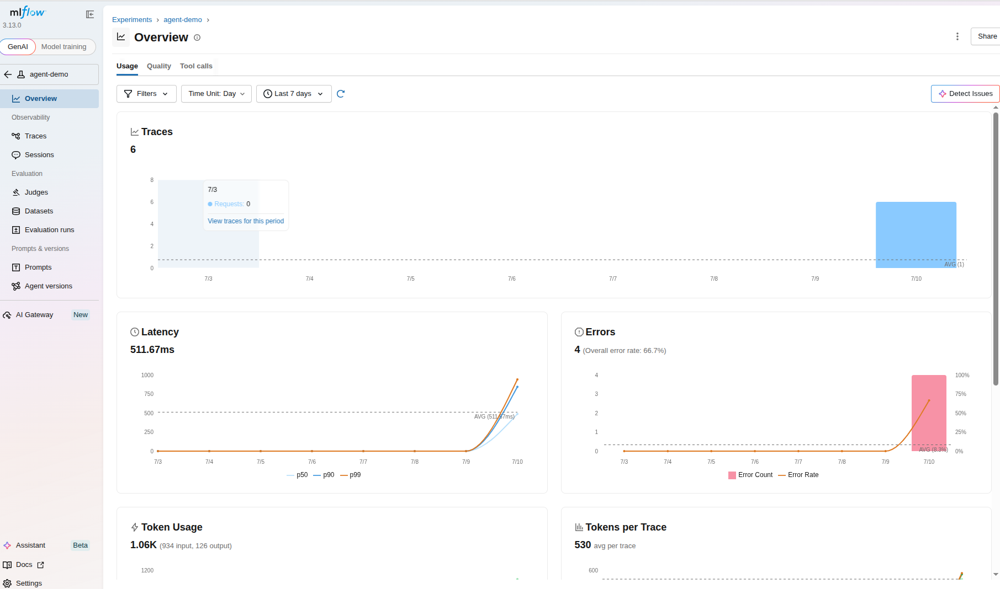
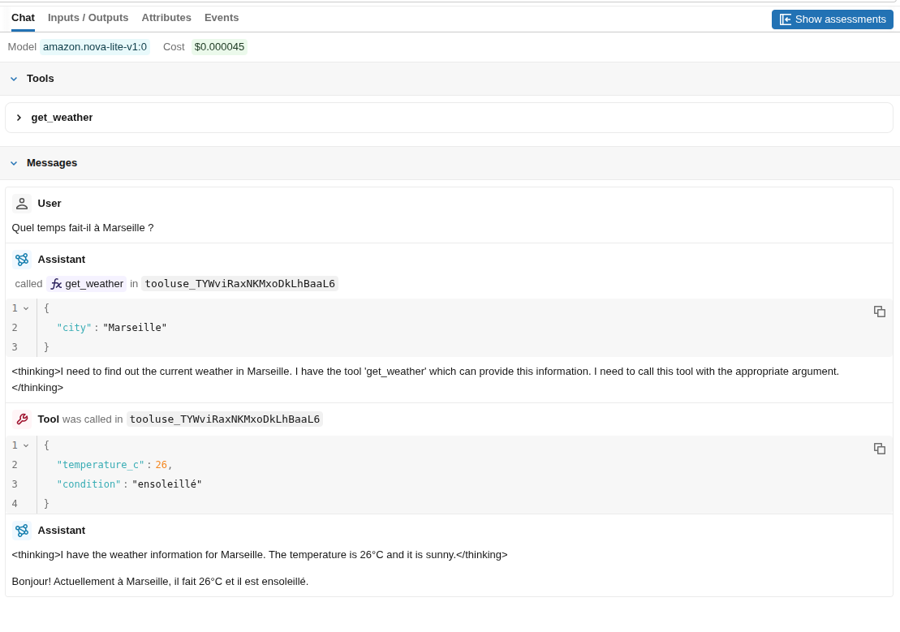

summary: TP9
id: tp9
categories: tp, api
tags: api, flask
status: Published
authors: OCTO Technology
Feedback Link: https://github.com/octo-technology/Formation-MLOps-2/issues/new/choose

# TP9 - Traces d'un agent

## Vue d'ensemble

Duration: 0:10:00


### À l'issue de cette section, vous aurez découvert

- L'utilisation de MLflow pour stocker les traces d'un agent IA

### Mise en place du TP

Récupérer la branche de ce TP, utilisez la branche suivante :

```shell
git checkout 9_start_agent_traces
```

Explorer dans le dossier `demo` le fichier [integration_mlflow_agent.py](../demos/integration_mlflow_agent.py)

Il s'agit d'un petit Agent avec lequel nous pouvons intéragir pour obtenir la météo d'une ville, il dispose d'un tool

### Runner l'agent

Pour pouvoir utiliser l'agent, il vous faudra mettre en place quelques variables d'environnement : 
```shell
cp demos/.env.example demos/.env
```

Puis éditer le fichier `.env` et remplir le secret AWS_BEARER_TOKEN_BEDROCK avec la valeur fournie par le formateur.

Ensuite, vous pouvez lancer une intéraction avec l'agent en utilisant le code suivant : 
```shell
uv run python demos/integration_mlflow_agent.py
```

C'est dans le `__main__`, tout en bas du fichier qu'est définit la question posée. Le but ici étant de démontrer l'intégration de MLflow, l'intéraction est minimaliste pour limiter le code de démonstration. 


Si le modèle n'est plus accessible, il est possible de lister les modèles dispo,ibles avec le script : 
```shell
uv run demos/list_bedrock_models.py
```

## Intégrer le tracing dans mlflow.
Duration: 0:05:00

Nous allons maintenant outiller l'agent avec le système de tracing MLflow.

### Demander à MLflow de stocker les traces
Importez MLflow :
```python
import mlflow
```

Nommer l'expérimentation pour retrouver facilement les traces :
```python
mlflow.set_experiment("agent-demo")
```

Puis ajouter l'auto log associé à notre fournisseur de modèle bedrock :
```python
mlflow.bedrock.autolog()
```

### Intéragir avec l'agent
Lancer une intéraction avec l'agent en utilisant le code suivant :
```shell
uv run python demos/integration_mlflow_agent.py
```

Éventuellement, faites en quelques autres.

### Visualiser les traces
Retourner dans l'interface MLflow et naviguer dans l'onglet GenAI / Experiments

Cliquer sur le nom de l'agent que vous avez choisi et explorer :
- les indicateurs obtenus (overview dans le menu)
    
- les traces des différents calls (Traces dans le menu)
    


## Pour aller plus loin
Duration: 0:05:00

- Quels usages pouvez-vous faire de ces traces ?
- Quelles limites y a-t-il à stocker les traces dans un tel outil ? 

## Lien vers le TP suivant

Duration: 0:01:00

Les instructions du tp suivant sont [ici](https://octo-technology.github.io/Formation-MLOps-2/tp10#0)